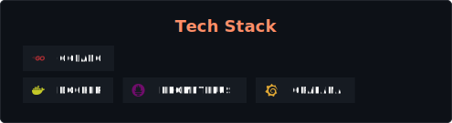
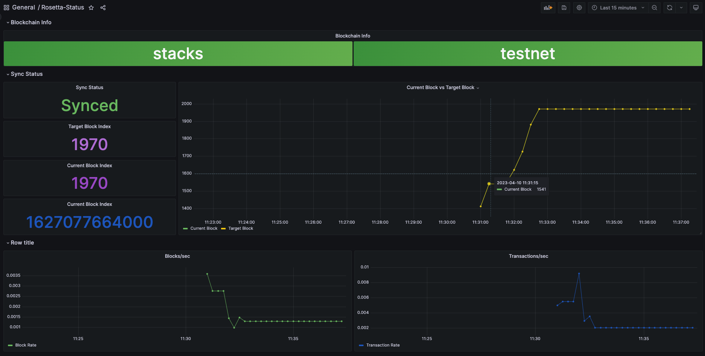

# Prometheus Rosetta Exporter
Using the [Rosetta implementation](https://www.rosetta-api.org/docs/rosetta_specifications.html) of a blockchain, the exporter porvides the ability to monitor the blockchain statistics using prometheus and graphana



## Getting Started

### Pre-requisites
This project requires a running rosetta endpoint

### Environment variables
The exporter expects the following variables passed as either environment variables or ``.env`` file in-case of docker compose.
Environment Variable | Description
---------------------| -----------
ROSETTA_URL| HTTP url for rosetta e.g http://127.0.0.1:3999
SAMPLE_SIZE | An integer to specify the number of blocks to average transaction and block rate. e.g 5
 
## Configuration

### Prometheus
For the prometheus exporter scrape config, it is located in [prometheus.yaml](crates/prometheus/prometheus.yaml)

### Grafana
The grafana dashboard can be imported from [rosetta-monitor.json](crates/grafana/dashboards/rosetta-monitor.json)


## Running with Docker

### Docker image
The docker image can be built using the [Dockerfile](Dockerfile)

### Docker Compose
Using the following command, you should be able to build and run using docker compose.
```
docker compose up -d exporter
```

## Running Grafana and Prometheus

The docker compose consists of configuration to run all services including exporter, prometheus and graphana

To run all three services use:
```
docker compose up -d
```

### Access urls
The access urls of various services when run locally with docker compose
Service | URLS
--------|-----
Grafana|http://localhost:3000/
Exporter|http://localhost:9101/metrics
Prometheus|https://localhost:9090


## Exposed metrics

Metric | Description
------ | -----------
blockchain_info| contains blockchain name and info as labels
rosetta_info| Version of rosetta
node_info| Version of the node
curr_block_index| Index of current block
curr_block_timestamp| Timestamp of the current block
sync_status| \*Is the blockchain synced or not. 

**Note**: ``sync_status`` is not a universal measure of sync status of a chain since it is optional and some blockchains implement it differently
